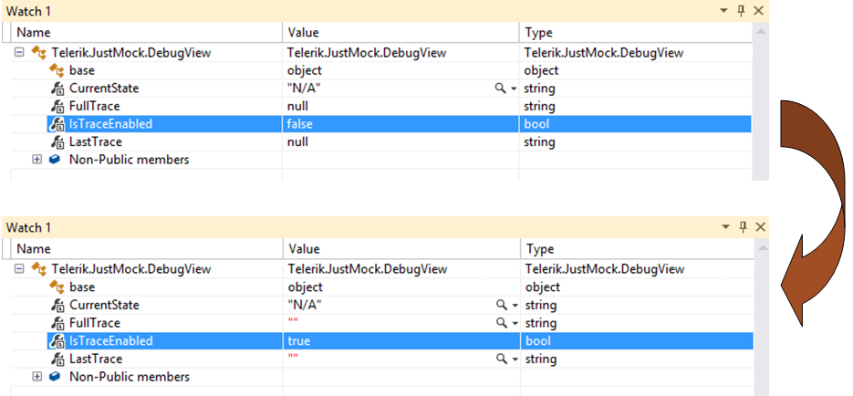
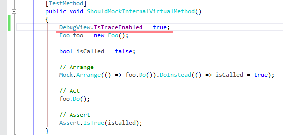
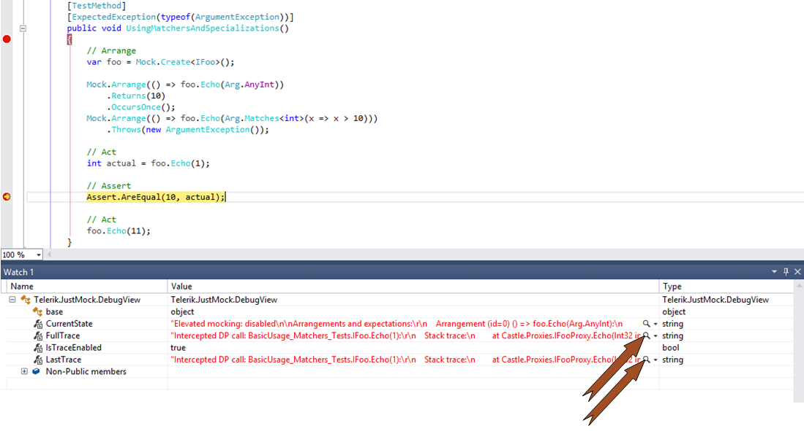
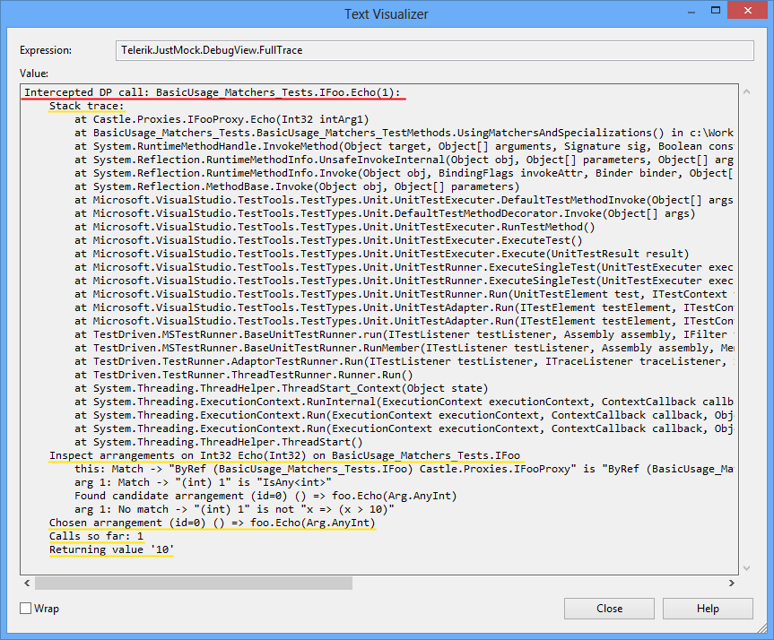
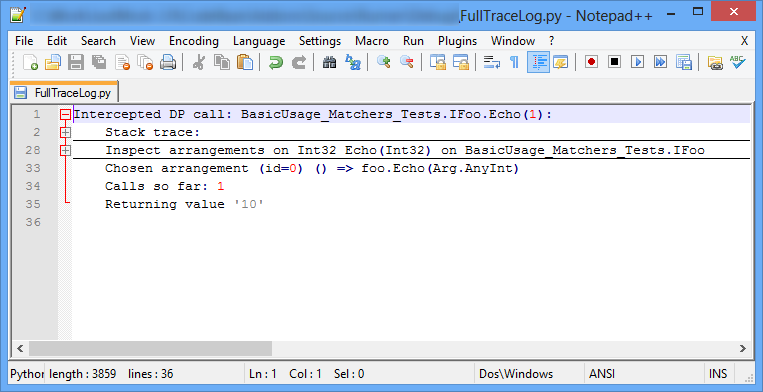

# Debug View

In this article you will find information about the __Debug View__ usage in Telerik JustMock. It is really useful when it comes to debugging tests and finding where the unexpected behavior comes from.

The article will cover all of the __Debug View__'s functionalities. It will also give some good practices about where and what to look for in order to check the correctness of a certain test.

## Enabling the Debug View
__Debug View__ can be used only while debugging your test methods. To do so, place a breakpoint at the start of the inspected test and run the debugger. When the breakpoint is hit, open the Watch window and add the __Debug View__ by writing: *Telerik.JustMock.DebugView* or just *DebugView* under the Name column.

Expanding the __Debug View__, you will notice there are 4 fields:

* __CurrentState__
* __FullTrace__
* __IsTraceEnabled__
* __LastTrace__

At first the fields will be empty. The information in them will be populated step by step, while debugging the test method.

## Inspecting the Current State
The __CurrentState__ field lists all of the arrangements that have been made during the test execution, all of the invocations and the elevated mocking state. This field will be updated accordingly after every new arrangement or invocation in the test method. You can use the text visualizer to inspect the __CurrentState__ as shown below:

In the Text Visualizer you will be able to see: 
* __Elevated mocking__ - Enabled or disabled depending if the JustMock profiler is turned on or off. 
* __Arrangements and expectations__ - Here you will find full list of all the arrangements made so far along with their expectations. 
* __Invocations__ - Shows all invocations with their arguments types and values. Another thing you can see, is how many times certain invocation has been executed. 

## Tracing the Test Execution
Tracing your test method gives more details about the intercepted invocations order. The JustMock __Debug View__ will gather information about all intercepted calls. It will show their stack traces, matching arguments, the chosen arrangement, calls made so far and the return value (for functions). Another thing when trace is enabled is that, the debugger will print the tracing log in the Output window.

To enable the tracing mode inside the __Debug View__, you must set the __IsTraceEnabled__ field to *true* at the beginning of the test method. This can be achieved by putting a breakpoint there and editing the value inside the Watch window.

Another option is to add: `DebugView.IsTraceEnabled = true;` as a first line of the test method. This will automatically enable the tracing option in debug mode.

While tracing, you can operate with the rest two fields from the __Debug View__: the __FullTrace__ and the __LastTrace__. 
* __FullTrace__ - Gives information about all the intercepted invocations in the test method. 
* __LastTrace__ - Gives information only about the last intercepted invocation in the test execution. 

Once again, you can use the text visualizer to inspect the information in the fields:

In the text visualizer you will be able to see the following information about each intercepted call: * __Stack trace__ - The full stack trace of the invocation. 
* __Matching arrangements on the particular call__ - All arrangements made for that member. 
* __Chosen arrangement__ - The applied arrangement in the test method. 
* __Number of calls__ - The number of calls made to that member. 
* __Return value (for functions only)__ - The return value of the function. 

As the logs can be rather long, you can copy them from the Visual Studio's Text Visualizer and paste them in another source code editor (Notepad++ for example). Then, changing the language to Python will provide the possibility of collapsing or expanding certain groups inside the log. Further, you will also get an appropriate syntax highlighting:

