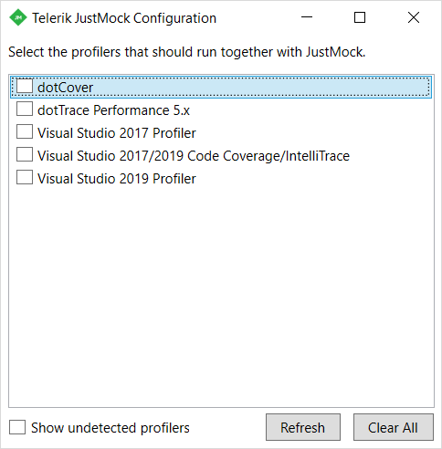
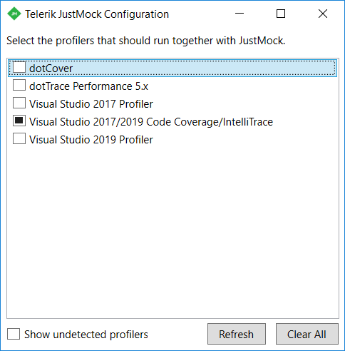

# Code Coverage Tools

This topic shows how easy and intuitive is to integrate __Telerik® JustMock__ with Code Coverage or other profiling tools.

The examples demonstrate integration with Visual Studio Code Coverage/IntelliTrace

## Running the JustMock Configuration Tool

The JustMock configuration tool is a stand-alone application which could be found in the JustMock root folder (ex: C:\Program Files (x86)\Progress\Telerik JustMock\Libraries). Navigate to the folder and run the __Telerik.JustMock.Configuration.exe__ file.

Once into the configuration window, you will be able to choose from one of the automatically detected profiler using tools and click on its checkbox to link it with the JustMock profiler *(you should notice the progress bar while the profilers are being linked)*. Once completed, a tick will remain against the name of the linked tool.

You can link and unlink profilers from the command line. This is useful for integrating 3rd party profilers into your build system. This is done by executing Telerik.JustMock.Configuration.exe with the /link or /unlink option. 

`start /wait "" "C:\Program Files (x86)\Telerik\JustMock\Libraries\Telerik.JustMock.Configuration.exe" /link "Visual Studio 2017/2019 Code Coverage/IntelliTrace"`

`start /wait "" "C:\Program Files (x86)\Telerik\JustMock\Libraries\Telerik.JustMock.Configuration.exe" /unlink "Visual Studio 2017/2019 Code Coverage/IntelliTrace"`

The parameter to the /link (and /unlink) option is the name of the profiler to link (or unlink) exactly as it is shown in the UI of the configuration tool. The *start /wait ""* bit is necessary so that any errors are correctly reported through the exit code. If the *start /wait ""* bit is omitted, then the tool will always return an exit code of 0, regardless of errors. A non-zero code is returned if the specified profiler is not installed or if there's a typo in the profiler name. Specifying /unlink with no parameter will unlink all profilers.

Further, you can expand the list with showing the undetected profilers, to see the official list of the supported 3rd party profiler using tools in  JustMock.   
            

## Unlinking Profilers

To detach the profilers for any reason, you will need to click once again on the check box or use the __Clear All__ button, which will remove all of the current configurations.

Reinstalling or repairing the installation of a 3rd party profiler tool, as well as re-registering its profiler, will disable the integration.
          

## See Also

 * [NCover]()

 * [OpenCover]()

