# TFS 2010

JustMock Code Activity Workflow is designed to deploy your JustMock test projects to TFS 2010 with zero manual configurations for setting up your build environment.

It breaks you free from tedious configuration of environment variables and provides you simple options that can get you on the move in no time. In this topic we will focus on what are the required configuration steps when working with JustMock Code Activity Workflow.

> **Important**
>
>  Be sure, you have referred to the [ Integrating Telerik JustMock in TFS 2010 Code Activity Workflow ](/getting-started/installation-instructions#integrating-justmock-in-tfs-code-activity-workflow) before continuing with the steps below. 

> **Note**
>
> You could also check the step-by-step video about [How to configure JustMock test execution within TFS code activity workflow](https://tv.telerik.com/watch/justmock/how-to-configure-justmock-test-execution-within-tfs-code-activity-workflow).
          

## Configuration Steps

First, you need to point the custom assemblies folder that contains __Telerik.JustMock.Build.Workflow.dll__ to your build controller.
              
> **Note**
>
> The DLL is included in the  __JustMock__  installation directory under the *Libraries*  folder.
                
You can do this by editing your build controller properties. Go to *Team Explorer*, then *Builds* and from the *Actions* menu select *
Manage Build Controllers *. You will be prompted with a dialog similar to the one below: 
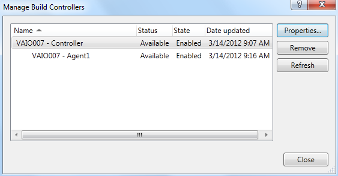
Select the main controller for your build and click properties. Then you have to set the 
* "Version control path to custom assemblies" 
* property to the location of the folder containg the __Telerik.JustMock.Build.Workflow.dll__.
            
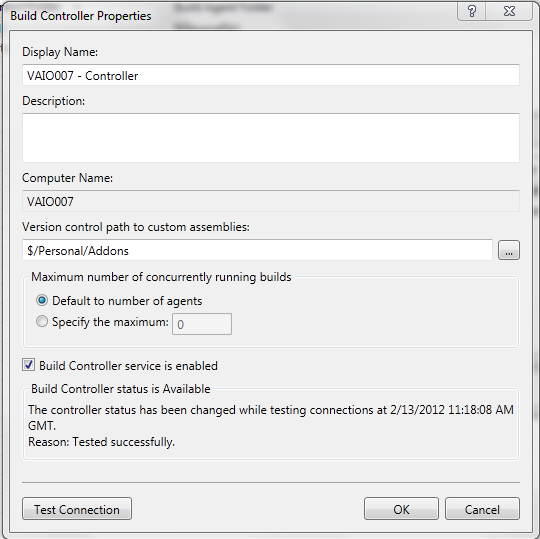
Here we have set the following properties:
* __Version control path to custom assemblies__ - *$/Personal/Addons*

Continue by configuring the __Default Template__ of your team project.
            

To make changes to your *DefaultTemplate* you will need to: 
* Check out for editing the *BuildProcessTemplates* from the *Source Control*.

* Create new class library project (This will be a dummy project. Its only purpose is for editing the template. You don`t need to add it to your solution or team collection).
                  
* Refer __Telerik.JustMock.Build.Workflow.dll__.
                
* Include the __Default Template__ in your project, using the *Add as Link* option. If you are new to TFS, the DefaultTemplate is a xaml file where the activity is dropped. You can find it under the *BuildProcessTemplates* folder of your TFS: 

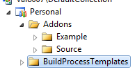

* Once added, set its __Build Action__ to *None*.
                
* For changes to take effect in the original template, you will just need to save them in this "dummy" project. Then check-in your *DefaultTemplate*. Below is a screenshot of a section from the Default Template:
            
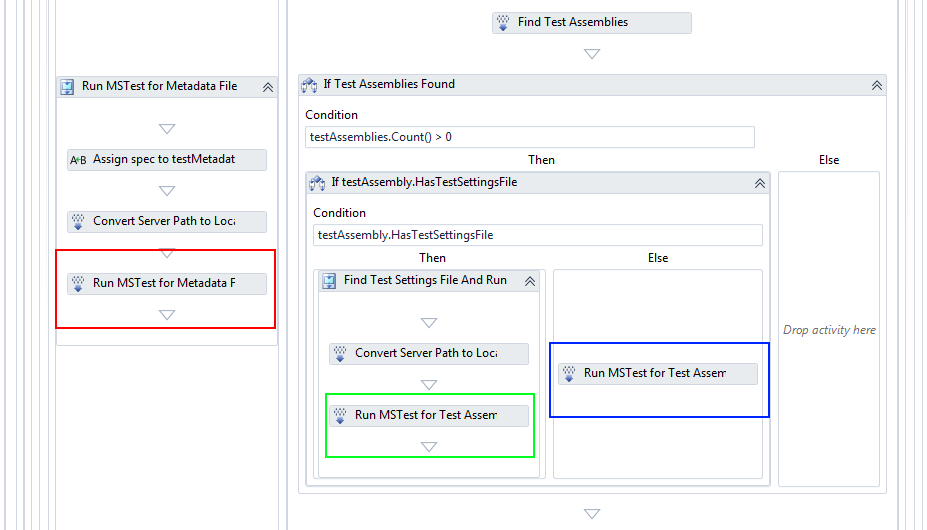

Next, you will have to replace some of the default activities. The activities to be replaced are marked with __red__, __green__ and __blue__ boxes . On their places you will need to put the __JustMockTestRunner__ activity.
            
In order to drag/drop the JustMockTestRunner activity to your build template (having the appropriate __Telerik.JustMock.Build.Workflow__ DLL refered to your project, as explained above). You also need to add the assembly into your *Toolbox* pane by choosing *Tools* > *Choose Toolbox Items*. Then, select *Browse* and point to the DLL in your custom assemblies folder (in this example: *$/Personal/Addons*).
            
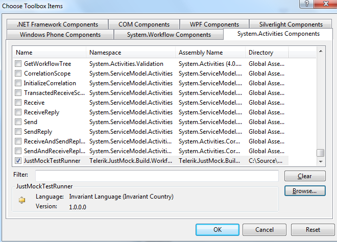

After replacing the activities, your template must look like this: 
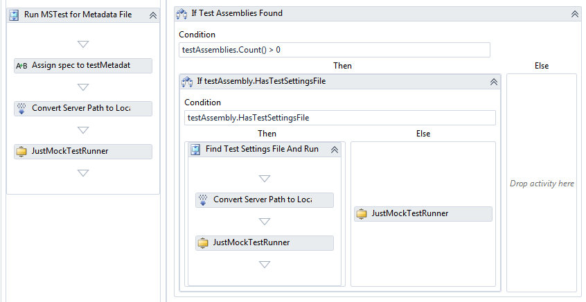

Before configuring each of the above added __JustMockTestRunner__ activities settings, you must define the *ResultSummary* variable. It is used by __JustMock__ to store the test result (*Passed* / *Failed*) and as such it will flag test status in later stage. The variable must be of type  *Telerik.JustMock.Build.Workflow.ReturnCodes* and its scope must be *Sequence*.
            

Then, you can continue with configuring the __JustMockTestRunner__ activities settings. 
            
Start by setting the values of the __red__ activity *(from step 2)* as shown in the screenshot below. It is for metadata based testing. Therefore, you set the __TestMetaData__ along with __TestLists__ variables. 

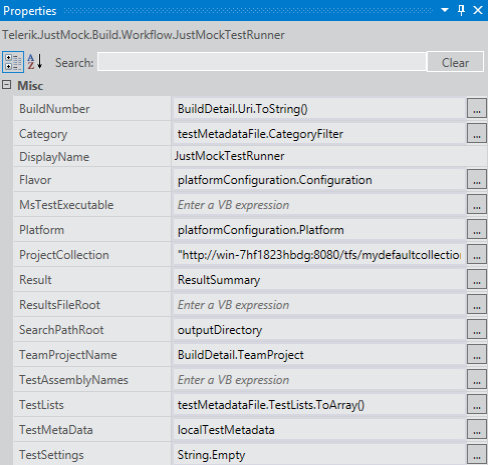

Here we have set the following properties:

* __BuildNumber__ - *BuildDetail.Uri.ToString()*

* __Category__ - *testMetadataFile.CategoryFilter*

* __DisplayName__ - *JustMockTestRunner*

* __Flavor__ - *platformConfiguration.Configuration*

* __Platform__ - *platformConfiguration.Platform*

* __ProjectCollection__ - *"http://vaio007:8080/tfs/DefaultCollection/"*

* __Result__ - *ResultSummary*

* __SearchPathRoot__ - *outputDirectory*

* __TeamProjectName__ - *BuildDetail.TeamProject*

* __TestLists__ - *testMetadataFile.TestLists.ToArray()*

* __TestMetadata__ - *localTestMetadata*

* __TestSettings__ - *String.Empty*

Continue by setting the values of the __green__ activity *(from step 2)*. The activity looks for a test settings defined by your MS Test project. Therefore, you must point the test assemblies and settings via the __TestAssembilyNames__ and __TestSettings__ variables. Check the screenshot and the details below:
            
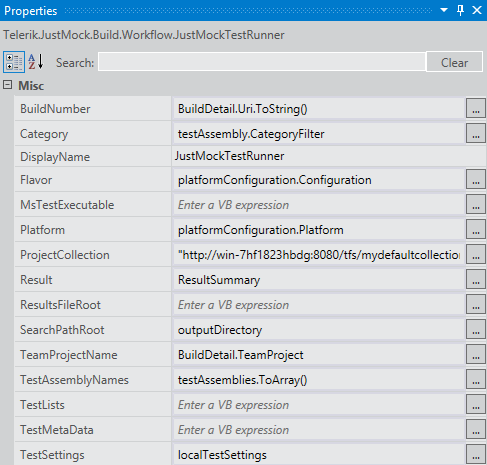

Here we have set the following properties:

* __BuildNumber__ - *BuildDetail.Uri.ToString()*

* __Category__ - *testAssembly.CategoryFilter*

* __DisplayName__ - *JustMockTestRunner*

* __Flavor__ - *platformConfiguration.Configuration*

* __Platform__ - *platformConfiguration.Platform*

* __ProjectCollection__ - *"http://vaio007:8080/tfs/DefaultCollection/"*

* __Result__ - *ResultSummary*

* __SearchPathRoot__ - *outputDirectory*

* __TeamProjectName__ - *BuildDetail.TeamProject*

* __TestAssemblyNames__ - *testAssemblies.ToArray()*

* __TestSettings__ - *localTestSettings*

Finally, for the *blue* activity *(from step 2)* you must specify the test assemblies as shown in the next screenshot:
            
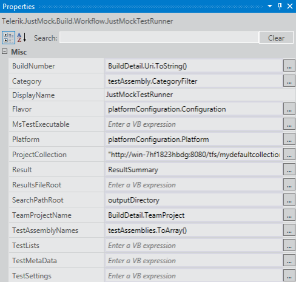

Here we have set the following properties:
* __BuildNumber__ - *BuildDetail.Uri.ToString()*

* __Category__ - *testAssembly.CategoryFilter*

* __DisplayName__ - *JustMockTestRunner*

* __Flavor__ - *platformConfiguration.Configuration*

* __Platform__ - *platformConfiguration.Platform*

* __ProjectCollection__ - *"http://vaio007:8080/tfs/DefaultCollection/"*

* __Result__ - *ResultSummary*

* __SearchPathRoot__ - *outputDirectory*

* __TeamProjectName__ - *BuildDetail.TeamProject*

* __TestAssemblyNames__ - *testAssemblies.ToArray()*

Moving forward, you have to specify the condition on which the build will pass/fail.

Drag an *"If"* activity (you can find it under *Toolbox* > *Control Flow*) between *"If TestStatus = Unknown"* and *"If TreatTestFailureAsBuildFailure And (TestStatus = Failed)"* activities. Set its properties as follows:
            
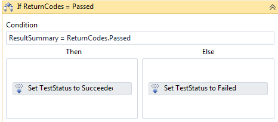

For *Set TestStatus to Succeeded*: * __PropertiesToSet__ - *TestStatus*

* __TestStatus__ - *Microsoft.TeamFoundation.Build.Client.BuildPhaseStatus.Succeeded*

For *Set TestStatus to Failed*: * __PropertiesToSet__ - *TestStatus*

* __TestStatus__ - *Microsoft.TeamFoundation.Build.Client.BuildPhaseStatus.Failed*

This will be used by the next block that will modify the build based on the value returned by the activity:

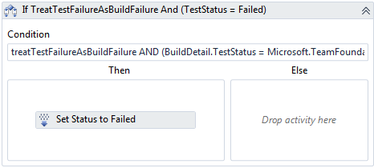

Once all three sections are set, your JustMock tests that require profiler will work as expected. You can further expand the build to check test status and view the test results file that is created by the activity.
            
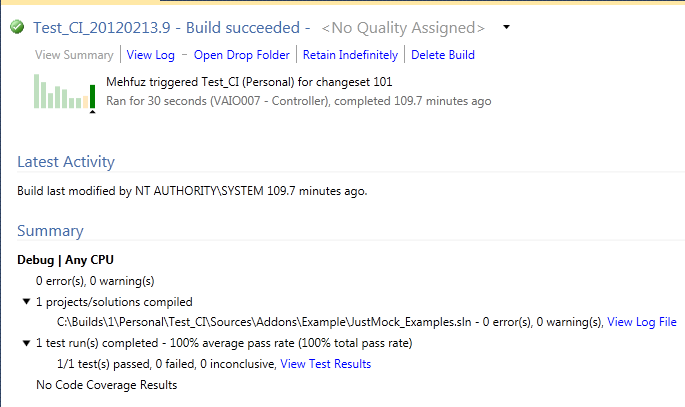

## See Also

 * [Cruise Control .NET]()

 * [Jenkins CI]()

 * [TeamCity]()
